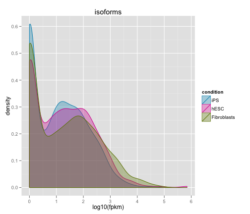
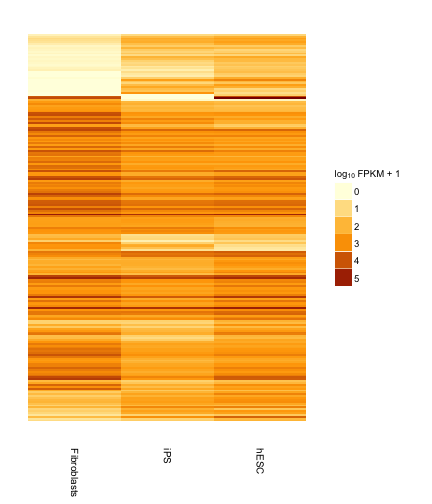
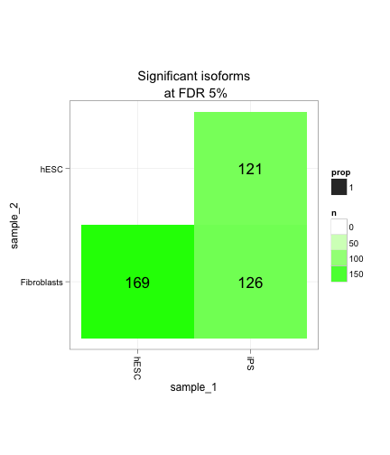

Run Report
==========

Analysis Parameters
-------------------


```r
alpha = 0.05
```


Global Statistics
-----------------


```r
cuff
```

```
## CuffSet instance with:
## 	 3 samples
## 	 400 genes
## 	 1203 isoforms
## 	 662 TSS
## 	 906 CDS
## 	 1062 promoters
## 	 1986 splicing
## 	 990 relCDS
```


### FPKM distributions


```r
csDensity(genes(cuff))
```

 

```r
csDensity(isoforms(cuff))
```

 


Significant features
--------------------

### Genes


```r
sigMatrix(cuff, level = "genes")
```

 


```r
sigGeneIDs <- getSig(cuff, alpha = alpha)
sigGenes <- getGenes(cuff, sigGeneIDs)
```


There are `207` significantly different genes at a `5`$\%$ FDR. 

#### Visualizations


```r
csHeatmap(sigGenes, cluster = "both", labRow = F)
```

```
## Using tracking_id, sample_name as id variables
```

```
## Using as id variables
```

 


### Isoforms


```r
sigMatrix(cuff, level = "isoforms")
```

 

